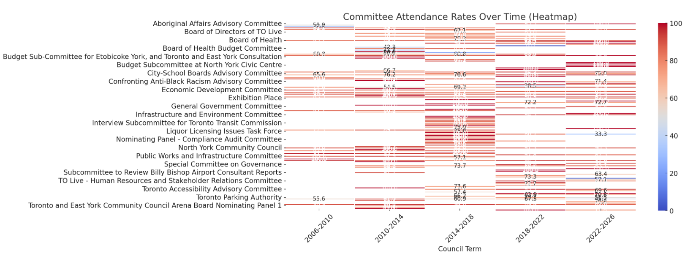
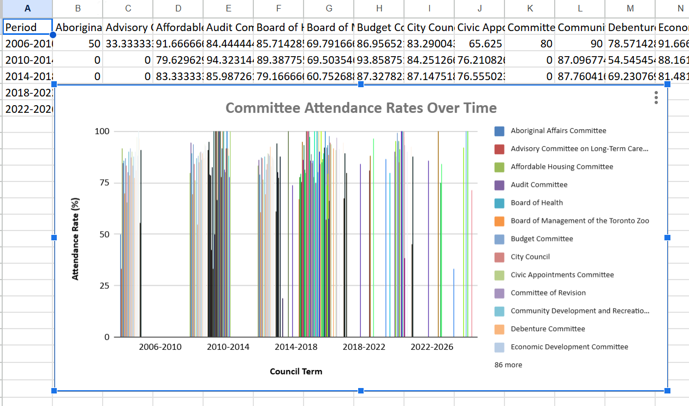

# Data Visualization

## Assignment 3: Final Project

### Requirements:
- We will finish this class by giving you the chance to use what you have learned in a practical context, by creating data visualizations from raw data. 
- Choose a dataset of interest from the [City of Toronto’s Open Data Portal](https://www.toronto.ca/city-government/data-research-maps/open-data/) or [Ontario’s Open Data Catalogue](https://data.ontario.ca/). 
- Using Python and one other data visualization software (Excel or free alternative, Tableau Public, any other tool you prefer), create two distinct visualizations from your dataset of choice.  
- For each visualization, describe and justify: 
    > What software did you use to create your data visualization?
Python (matplotlib and Seaborn) &Excel
    > Who is your intended audience? 
    Audience includes city residents, governement officials, policy analysts, and journalists who are interested in understanding the attendance trends of Toronto City Councillors over time.
    > What information or message are you trying to convey with your visualization? 
The heatmap and bar chart present average attendance rate of councillors over deliver council terms (2006-2026). It helps identify patterns in attendance, wheather attendance has improved or decliened. Also highlights which committes have high engagement and which need to improve. 
    > What design principles (substantive, perceptual, aesthetic) did you consider when making your visualization? How did you apply these principles? With what elements of your plots? 
Substantive: data is aggregated by committe and council term for a clear comparison. 
Perceptual: heatmap color gradient helps distinguish high and low attendance.  
    > How did you ensure that your data visualizations are reproducible? If the tool you used to make your data visualization is not reproducible, how will this impact your data visualization? 
 Python code is included in the appendix also with #explaination , allowing orders to review and replicate   
 Excel file: it contains the raw dataset and embadded bar chart to alloing others to reprduce 
    > How did you ensure that your data visualization is accessible?  
Pythone Heatmap uses a clear color gradient to differentiate values. Proper font sizes and labeled axes enhance readability.
Excel bar chart has axies labels and numerical values make data interpretation straightforward. 
    > Who are the individuals and communities who might be impacted by your visualization?  
City residents: help them assess committee engagement levels
City officials: can use this to improve the service 
media: useful for evaluating governmeent progress 
    > How did you choose which features of your chosen dataset to include or exclude from your visualization? 
  include committee attendance rates per council term for historial trends 
  Excluded individual councillor detials to focus on the overall committee level engagement.   
    > What ‘underwater labour’ contributed to your final data visualization product?
Data cleaning and visiualization optimization on pythone
Data compilation and excel chart formating on excel 

- This assignment is intentionally open-ended - you are free to create static or dynamic data visualizations, maps, or whatever form of data visualization you think best communicates your information to your audience of choice! 
- Total word count should not exceed **(as a maximum) 1000 words** 

 Data source : https://open.toronto.ca/dataset/members-of-toronto-city-council-meeting-attendance/
Members of Toronto City Council - Meeting Attendance

Conclusion: These visualizations help policymakers, researchers, and the public assess councillor engagement effectively. Significant data preparation, analysis, and visualization refinements were made to ensure clarity and impact.
 
### Why am I doing this assignment?:  
- This ongoing assignment ensures active participation in the course, and assesses the learning outcomes: 
* Create and customize data visualizations from start to finish in Python
* Apply general design principles to create accessible and equitable data visualizations
* Use data visualization to tell a story  
- This would be a great project to include in your GitHub Portfolio – put in the effort to make it something worthy of showing prospective employers!

### Rubric:

| Component         | Scoring  | Requirement                                                                 |
|-------------------|----------|-----------------------------------------------------------------------------|
| Data Visualizations | Complete/Incomplete | - Data visualizations are distinct from each other - Data visualizations are clearly identified - Different sources/rationales (text with two images of data, if visualizations are labeled) - High-quality visuals (high resolution and clear data) - Data visualizations follow best practices of accessibility |
| Written Explanations | Complete/Incomplete | - All questions from assignment description are answered for each visualization - Explanations are supported by course content or scholarly sources, where needed |
| Code              | Complete/Incomplete | - All code is included as an appendix with your final submissions - Code is clearly commented and reproducible |

## Submission Information

🚨 **Please review our [Assignment Submission Guide](https://github.com/UofT-DSI/onboarding/blob/main/onboarding_documents/submissions.md)** 🚨 for detailed instructions on how to format, branch, and submit your work. Following these guidelines is crucial for your submissions to be evaluated correctly.

### Submission Parameters:
* Submission Due Date: `23:59 - 09/03/2025`
* The branch name for your repo should be: `assignment-4`
* What to submit for this assignment:
    * A folder/directory containing:
        * This file (assignment_3.md)
        * Two data visualizations 
        * Two markdown files for each both visualizations with their written descriptions.
        * Link to your dataset of choice.
        * Complete and commented code as an appendix (for your visualization made with Python, and for the other, if relevant) 
* What the pull request link should look like for this assignment: `https://github.com/<your_github_username>/visualization/pull/<pr_id>`
    * Open a private window in your browser. Copy and paste the link to your pull request into the address bar. Make sure you can see your pull request properly. This helps the technical facilitator and learning support staff review your submission easily.

Checklist:
- [ ] Create a branch called `assignment-3`.
- [ ] Ensure that the repository is public.
- [ ] Review [the PR description guidelines](https://github.com/UofT-DSI/onboarding/blob/main/onboarding_documents/submissions.md#guidelines-for-pull-request-descriptions) and adhere to them.
- [ ] Verify that the link is accessible in a private browser window.

If you encounter any difficulties or have questions, please don't hesitate to reach out to our team via our Slack. Our Technical Facilitators and Learning Support staff are here to help you navigate any challenges.
